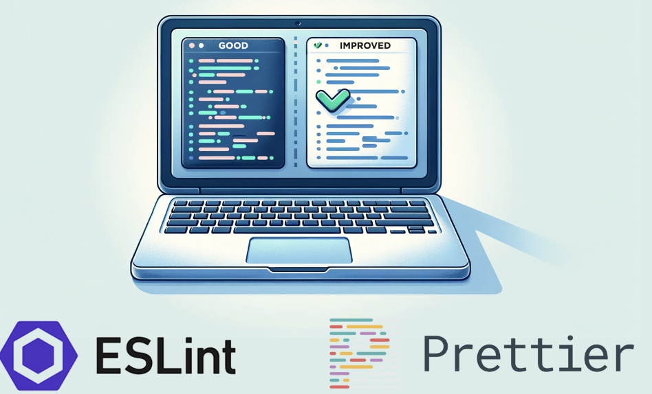

# Why Coding Standards Matter

Let's be honest: most people hate being told where to put a semicolon. The moment you mention "coding standards," eyes roll and developers groan about petty arguments over tabs versus spaces or whether curly braces deserve their own line well, I could be speaking for myself but that is my reaction every time. It feels downright annoying. But here's the contrarian take: coding standards aren't just about formatting aesthetics. They're training wheels for professional code that actually works in the real world. Stick with me now. When I first integrated ESLint into my VSCode workflow, I didn't see it as a tyrannical style enforcer. Instead, I saw it as a mentor that would catch me before I fell. And after a week of working with it, I can confidently say that if you can only implement one software engineering technique to improve quality, coding standards should be it.

ESLint didn't just teach me where to put semicolons. It taught me how to write TypeScript and JavaScript properly. My most memorable error from that first week? Missing type definitions that, at first glance, seemed completely unnecessary. Why did I need to explicitly type a variable when TypeScript could infer it? Why did I need to define the shape of an object when it was obvious from context? But ESLint forced me to confront my assumptions. Those "unnecessary" type definitions weren't just busywork. They were documentation, safety nets, and contracts all rolled into one. When I added explicit types to function parameters, I realized I was preventing future bugs where the wrong data type could slip through. When I defined interfaces for objects, I was creating a blueprint that other developers (or future me) could rely on. ESLint wasn't just enforcing rules. It was teaching me the language itself, one error message at a time.

Now, I won't sugarcoat it. Seeing your code light up like a Christmas tree with red squiggles is jarring at first. But here's the thing: I was actually excited to learn from them. Each error was a puzzle to solve, a gap in my knowledge to fill. Yes, there were moments of frustration when I had to refactor a function just to satisfy a linting rule, but that frustration was productive. It forced me to think critically about my code: Why is this variable unused? Why am I mutating this array instead of creating a new one? Why didn't I handle this edge case? The pain of fixing ESLint errors in the moment is nothing compared to the pain of technical debt down the line. Every squiggly line I addressed was a future headache I prevented. It was a bug I wouldn't have to debug at 2 AM before a deadline, a confusing variable name a teammate wouldn't have to decipher, a runtime error that wouldn't crash in production. The "pain" was actually an investment in code quality that pays dividends immediately.

What resonated most with me after that first week wasn't just one benefit. It was all of them working together. ESLint caught bugs before they happened, like when it flagged unused variables that indicated logic errors in my code. It taught me better syntax and patterns, showing me the idiomatic way to write JavaScript instead of just the way that technically works. It made my code more readable for teams, ensuring that anyone who touched my files would see consistent, predictable structure. And perhaps most importantly, it built professional coding habits. I stopped thinking of code as something that "just works" and started thinking of it as something that needs to be maintainable, scalable, and collaborative. ESLint transformed my mindset from "does it run?" to "would I be proud to show this to a senior engineer?"

As I am almost near the end of my computer science degree, I've come to see coding standards not as restrictions, but as liberations. They free me from making arbitrary decisions about formatting so I can focus on solving actual problems. They ensure that my code isn't just readable by me in this moment, but by teammates, future maintainers, and even future me six months from now when I've forgotten why I wrote something a certain way. In a professional environment, code is a shared artifact. It's a living document that multiple people will touch, modify, and depend on. Coding standards are the common language that makes collaboration possible.

So do I agree that coding standards can help you learn a programming language? Absolutely. They're not just rules to follow. They're lessons embedded in your development environment. Every ESLint error is an opportunity to learn something new about the language, about best practices, about what separates hobbyist code from professional code. The developers who dismiss coding standards as trivial minutiae are missing the forest for the trees. Yes, it matters where you put the semicolon, but it matters because consistency, readability, and maintainability matter. And in the long run, those "trivial" standards are what separate code that merely works from code that lasts.

# AI was used to correct grammar and reformat sentence organization. 
