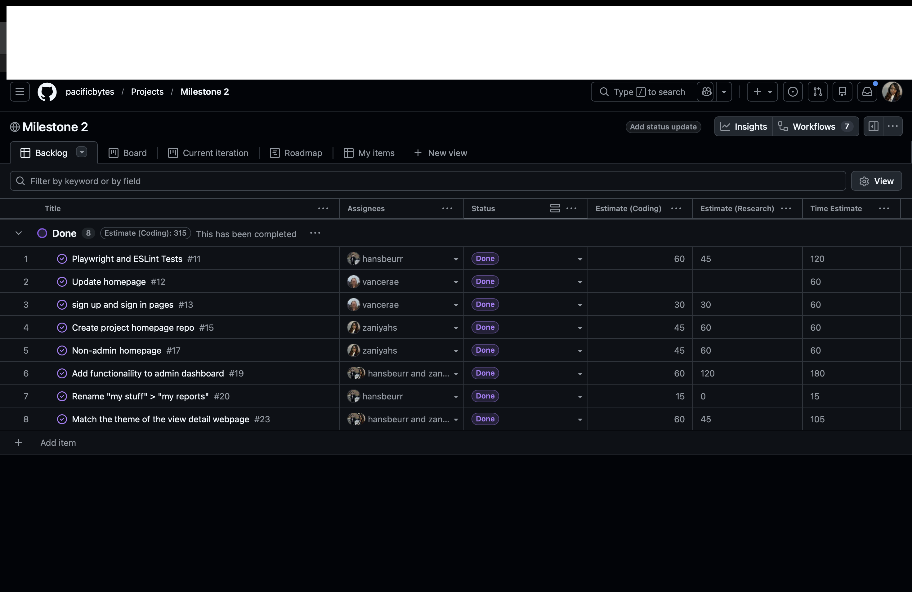

<!DOCTYPE html>
<html lang="en">
<head>
  <meta charset="UTF-8" />
  <meta name="viewport" content="width=device-width, initial-scale=1.0" />
  <link href="https://fonts.googleapis.com/css2?family=DM+Serif+Display:ital@0;1&family=IBM+Plex+Mono:wght@400;600&family=DM+Sans:wght@300;400;500&display=swap" rel="stylesheet" />
  
</head>
<body>

<header>
  
ICS 314 — Effort Estimation Reflection

  <h1>Estimating the <em>Unestimatable</em>: My Honest Experience with Effort Tracking on Rainbow Locator</h1>
  

    Za'Niyah Smith
    May 2026
    University of Hawaiʻi at Mānoa
  

</header>

<main>

  

  <h2>Introduction</h2>

  

    When I first heard the words "effort estimation," I thought it sounded simple enough — just guess how long
    something will take, write it down, and move on. What I didn't expect was how much that simple act of
    guessing would teach me about myself as a developer, about my team's workflow, and about the unpredictable
    nature of building software from scratch. Working on <em>Rainbow Locator</em>, a lost and found website
    built for students at the University of Hawaii, gave me a real world crash course in project management
    that no textbook could have fully prepared me for.
  

  

    Rainbow Locator allows UH students to report lost items by submitting a description, a date, and the last
    known location on campus. Students who find items can also log them into the system, making it easier to
    reunite people with their belongings. My primary role on the team was focused on the front end — making
    sure the interface was clean, intuitive, and visually appealing. I had a smaller hand in the functional
    side of the app, but that didn't mean my tasks were any easier to estimate. Beyond the technical work,
    I also ended up serving as the team's live representative during class presentations, which meant I had
    to develop a thorough understanding of the entire project — not just the pieces I personally built. That
    experience gave me a unique perspective on the project as a whole and pushed me to stay informed about
    progress across the board, even on features outside my immediate lane. To be honest without having to do
    that I probably would have been very confused for 80% of the project.
  

  

  <h2>How I Made My Estimates</h2>

  

    With only about four months of software development experience under my belt, I didn't have a deep well
    of historical data to draw from when making estimates. I couldn't look back at a portfolio of past projects
    and say, "Oh, this is similar to that feature I built six months ago." Instead, I leaned heavily on
    intuition and task decomposition — breaking each issue down into smaller mental steps and assigning rough
    time blocks to each one — which the professor helped with tremendously by constantly reminding us that
    "you need to break that up into smaller issues."
  

  

    For example, when estimating styling tasks like building out a card component for lost item listings, I
    would think through the steps: researching the layout, writing the CSS, testing it across screen sizes,
    and making adjustments. Each of those felt like maybe 15–20 minutes individually, so I'd add them up and
    round to the nearest half hour. It wasn't scientific, but it gave me a structured starting point rather
    than just throwing out a random number. For issues that felt familiar — anything involving basic UI layout —
    I felt more confident. For anything touching logic or backend integration, I padded my estimates generously
    because I knew those areas were less predictable for me.
  

  

  <h2>Did Estimating Help Even When I Was Wrong?</h2>

  

    Honestly, yes — even when my estimates were off, the act of estimating forced me to actually <em>think
    through</em> a task before diving in. It made me ask: what does this issue actually require? That question
    alone saved me from starting work without a clear plan — which is a crucial step for a coder that is often
    overlooked.
  

  

    

      
60

      
minutes estimated for delete button

    

    

      
10

      
minutes it actually took

    

    

      
6×

      
overestimate — and that's okay

    

  

  

    One example that sticks out is the delete item button. I estimated it would take around 60 minutes,
    thinking there might be some confirmation logic or styling work involved. In reality, it took closer to
    10 minutes. I had overestimated because I was thinking about edge cases that turned out to be already
    handled elsewhere in the codebase. While that particular estimate was off, the exercise of thinking it
    through beforehand meant I wasn't scrambling when I actually sat down to work on it — I already knew
    my mental steps.
  

  

    On the flip side, there were times where my estimate being wrong in the <em>other</em> direction was
    equally informative. Those moments reminded me that software development rarely goes exactly as planned,
    and that building in buffer time is a skill worth developing.
  

  

  <h2>The Admin Login Page: When Estimation Gets Humbling</h2>

  

    The most instructive experience I had with effort tracking came from working on the admin login page. At
    first glance, it seemed like a straightforward task — we already had a login page for regular users, so
    how different could it be? I estimated it would take about the same amount of time, maybe slightly more.
  

  

    <strong>The Lesson</strong>
    

      What I learned from that experience wasn't just that I underestimated — it was <em>why</em> I
      underestimated. I had assumed similarity without verifying it. Going forward, I started asking more
      questions upfront before locking in an estimate, specifically looking for hidden complexity that might
      not be obvious at first glance.
    

  

  

    I was wrong. The admin login needed to be meaningfully different from the regular user flow — different
    UI cues to signal elevated access, and different validation logic. It took noticeably longer than I had
    planned, and I had to push back other tasks on my list to accommodate.
  

  

  <h2>How I Tracked My Actual Effort</h2>

  

    I tracked my time using manual start-stop notes on my phone. Whenever I sat down to work on an issue,
    I'd log the time I started, and when I stopped — I'd log that too. I kept these notes either in the
    GitHub issue comments or in a simple running document I kept open on the side.
  

  

    Was it perfectly accurate? Not at all. I didn't count bathroom breaks or social media scroll breaks.
    There were moments where I forgot to note my stop time and had to estimate it after the fact, which
    introduced some imprecision. That said, I believe my tracking was not <em>reasonably</em> accurate for
    coding tasks. Non-coding effort, like reading documentation, thinking through a design problem, or
    collaborating with teammates about layout decisions, was harder to capture consistently and likely
    slightly undercounted in my logs.
  

  

  <h2>AI Assistance: Claude as a Debugging Partner</h2>

  

    I used Claude (by Anthropic) during this project, primarily as a debugging aid when I got stuck on code.
    My use was relatively light — I didn't use it to generate large blocks of code wholesale, but rather to
    help me understand why something wasn't working the way I expected.
  

  

    A typical interaction looked like this: I'd paste in a snippet of code that was producing an unexpected
    result, describe what I wanted it to do, and ask Claude to help me identify the issue. In most cases,
    the explanation helped me understand the problem well enough to fix it myself. Occasionally I'd adapt a
    suggested fix directly into my code, but I always reviewed it carefully to make sure it fit the context
    of our specific project.
  

  

    <strong>Effort Accounting</strong>
    

      I counted the time I spent formulating my prompts, reviewing Claude's responses, testing any suggested
      fixes, and integrating changes as part of my coding effort. This felt like the most honest way to
      capture it — that time was genuinely spent working on the code, just with an AI collaborator in the loop.
    

  

  

  <h2>What I'd Do Differently Next Time</h2>

  

    Looking back, there are a few things I'd change about my process. First, I'd ask more questions before
    estimating. The admin login page taught me that surface level similarity between tasks can be deceiving.
    A quick five minute conversation with a teammate about the full scope of an issue before writing down an
    estimate would have saved me from several misses.
  

  

    I'd also be more intentional about tracking non-coding effort. Design thinking, planning sessions, and
    even the time spent reading documentation all contribute to how long an issue actually takes. Leaving
    that out of the picture gives an incomplete view of where time actually goes in a project.
  

  

  <h2>Conclusion</h2>

  

    Effort estimation seems pointless in the beginning, but I learned that it was needed in order to stay
    on track. It forces clarity, surfaces assumptions, and creates a feedback loop that makes you better
    over time. Working on Rainbow Locator taught me that the goal of estimation isn't to be right — it's
    to be reasonable, stay curious about why you were wrong, and use that information to improve. That,
    more than any specific tool or technique, is the real skill worth building.
  

</main>
</body>
</html>
